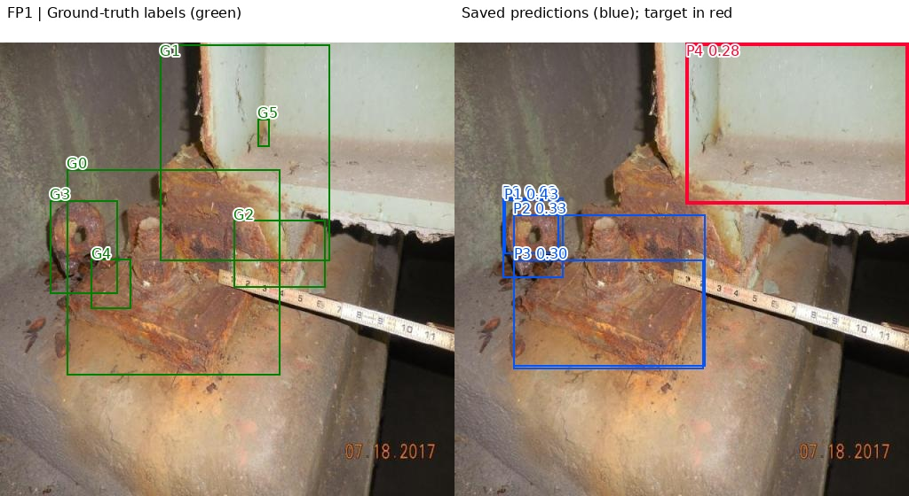
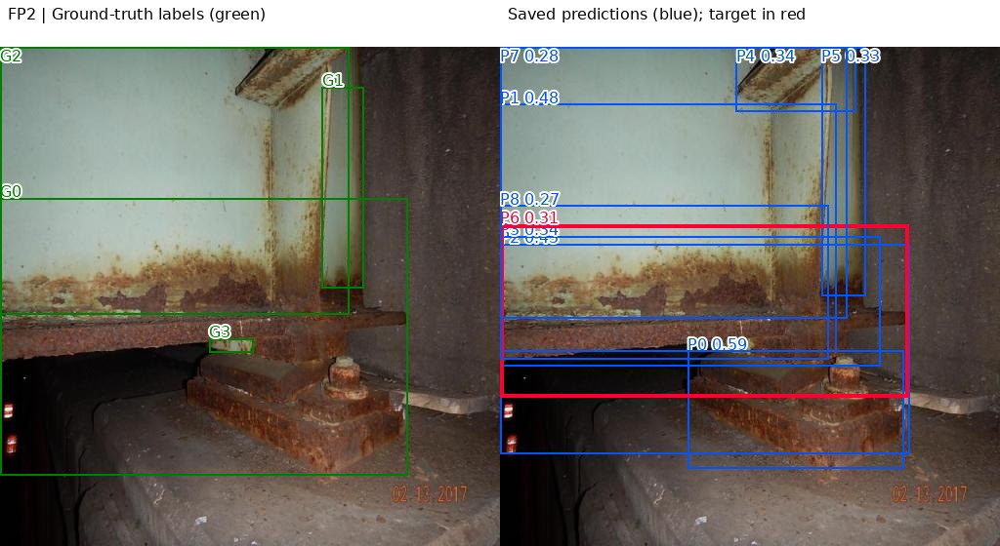
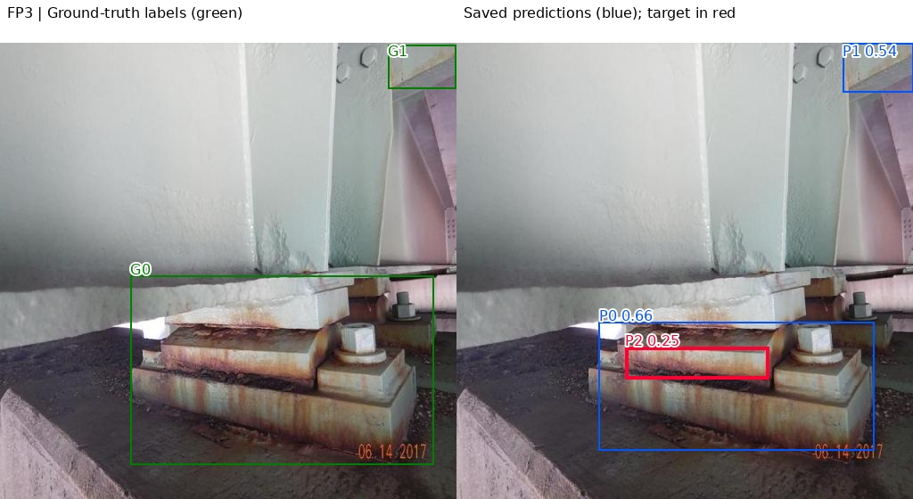
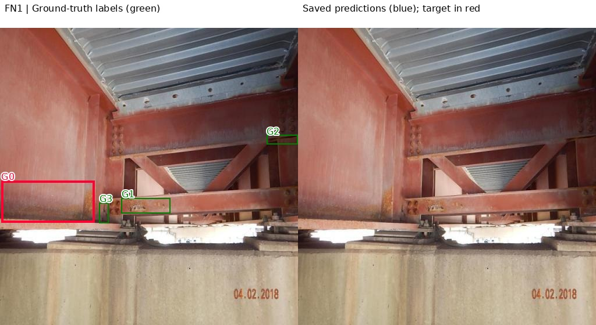
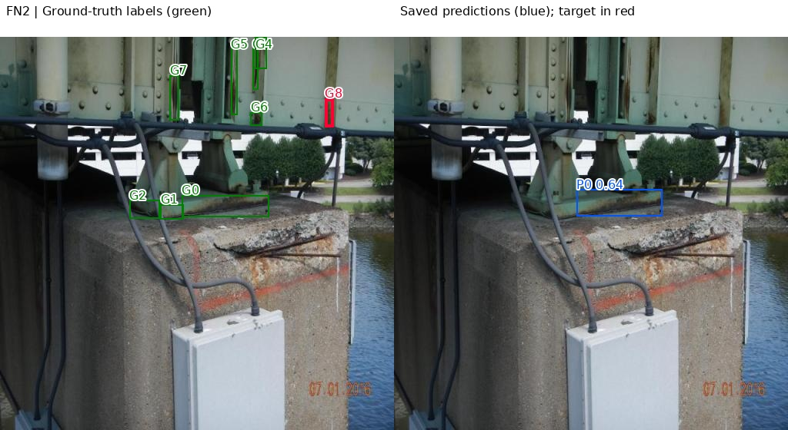
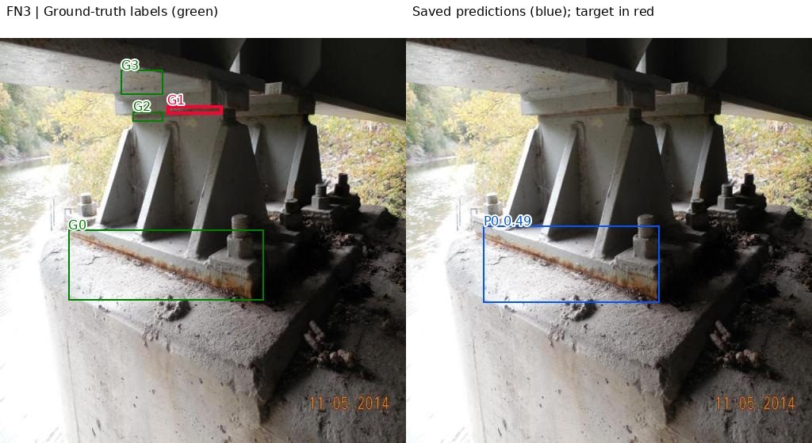

# Error analysis — steel rust detection

## Scope and method

This review uses the ten saved validation predictions from run `20260923_132304`, with prediction confidence **0.25**, and their corresponding labels in frozen dataset version 1. Coordinates are evaluated on the 512 × 512 source images. Original `test__` filename prefixes record provenance: these images belong to the notebook's 88-image validation split.

For this diagnostic review, predictions are processed by descending confidence and matched one-to-one to the highest-IoU unmatched rust label at **IoU ≥ 0.50**. An unmatched prediction is an FP and an unmatched annotation is an FN. These case-level checks do not recompute the official Ultralytics metrics, whose confidence sweep and matching procedure may differ. The saved prediction set has already undergone the notebook's inference filtering.

Green boxes show inherited annotations, blue boxes show saved predictions, and red highlights the selected error. G/P indices are zero-based line indices in the source label/prediction file. [Case coordinates and filenames](../results/evidence/error_analysis/cases.csv) make each selection traceable. Images below are diagnostic overlays made from the original images and saved box coordinates; no new model inference was performed.

An FP against a bounding-box annotation is not necessarily a rust-free surface. Localization, fragmented boxes and duplicate detections can produce FPs on real rust. The inherited labels are an imperfect reference: wide and overlapping boxes occur, and a comprehensive relabeling audit has not been completed. Causes below are hypotheses.

## Three false positives

### FP1 — broad box on the painted web (image 14, P4)

**Observation:** A box with confidence **0.284** covers much of the light painted web and does not follow the main rusted corner. Maximum overlap with any label is **IoU 0.277**, below 0.50. The region includes marks and a small annotated area; it is not asserted to be entirely rust-free.

**Hypothesis:** Paint discoloration, cracks and the adjacent heavily rusted corner may have encouraged an overly broad localization. Inconsistent source boxes could reinforce this behavior. Review similar examples and include painted, dirty but non-rusted surfaces as hard negatives.

### FP2 — duplicate detection of the lower rusted region (image 12, P6)

**Observation:** P6 has confidence **0.313** and overlaps G0 at **IoU 0.622**. However, higher-confidence P2 (**0.431**, IoU **0.752** with G0) already matches that label. P6 has no remaining valid unmatched label and counts as a duplicate FP under the stated one-to-one matching rule.

**Hypothesis:** The irregular corrosion patch and overlapping source annotations may encourage several slightly different boxes for one region. Consistent patch boundaries should be addressed before tuning suppression settings; more aggressive suppression could also remove detections of nearby distinct patches.

### FP3 — small fragment inside a larger annotated bearing region (image 18, P2)

**Observation:** P2 has confidence **0.253** and isolates a narrow rusty strip. Its maximum label overlap is only **IoU 0.082**, so it is an FP by the localization criterion. P0 already covers the larger annotated bearing region. Visible rust exists in P2: this is a box-scale/fragmentation error, not proof of a semantic rust-versus-background error.

**Hypothesis:** The model and the inherited labeling policy disagree on whether to represent a small patch or a larger component region. Review component-sized boxes and define a consistent rust-patch policy. Raising confidence would remove this individual box but may reduce recall elsewhere.

## Three false negatives

### FN1 — missed lower edge of the red-painted girder (image 10, G0)

**Observation:** G0 marks a discolored/corroded lower-edge region on the large left girder. The saved image has **no detections at confidence 0.25**, making this annotation unmatched (maximum IoU 0).

**Hypothesis:** Rust-like color close to the red paint and the wide view reduce contrast and detail. Confirm the label boundary manually, then add close and distant views of similar painted steel with verified rust and healthy paint examples.

### FN2 — missed thin vertical rust region (image 11, G8)

**Observation:** The narrow vertical annotated region on the upper-right steel web is missed. The only saved prediction is near the bearing/base; it has **zero overlap** with G8.

**Hypothesis:** A thin low-contrast feature occupies few pixels after resizing to 512. Add detailed examples of early corrosion along seams and stiffeners, alongside wider contextual views. Higher-resolution source imagery or tiling is a future experiment, not a tested improvement.

### FN3 — missed narrow upper connection strip (image 16, G1)

**Observation:** The narrow annotated strip at the upper bearing connection is missed, while the lower base region is detected. Maximum overlap between G1 and saved predictions is **IoU 0**.

**Hypothesis:** Shadows, backlighting and the small horizontal target may contribute. Collect confirmed examples of upper connections under varied illumination, including difficult shaded views.

## Three prioritized data improvements

1. **Audit leakage and group splits by structure/site.** Review near-duplicate views across the 352/88 split using similarity candidates followed by manual inspection. Assign views of the same structure or capture sequence to one split. Freeze a new manifest and version. This makes future error analysis more representative of unseen sites; results on a changed split must not be presented as a controlled improvement over this baseline.
2. **Standardize and audit annotations.** Define one box per visually coherent rust patch, tight enough to minimize healthy material. Resolve nested/duplicate boxes and patch-versus-component ambiguity. Review the six examples here and a pilot of approximately 30 diverse images before expanding to the dataset. Record corrections and reviewer disagreements. This directly addresses FP1–FP3 and uncertainty in inherited FN labels.
3. **Expand difficult examples and verified negatives.** Start with approximately 60 additional rights-cleared images: 20 with thin/small rust features, 20 with red paint or challenging shadows, and 20 healthy/dirty/painted steel negatives. Keep site groups separate, review all labels, and preserve the five existing personal photos as qualitative holdouts. This targets FN1–FN3 and background confusion in FP1. These counts are proposed collection targets, not data already collected.

## Interpretation and limitations

The six selected cases illustrate failure mechanisms; they are not prevalence estimates from the full validation set. Reported baseline precision is 35.51%, recall 36.49%, mAP50 29.23% and mAP50–95 12.24%. These metrics and the visual errors support use as an academic prototype requiring human review. The system cannot establish corrosion-free steel or structural safety.

Dataset-derived images: University of Tebessa, via Mohammad Mango's adapted Roboflow version 1; the export declares CC BY 4.0. Analytical overlays were added for this report. No claim is made that the proposed data improvements or a new model experiment have already been completed.
