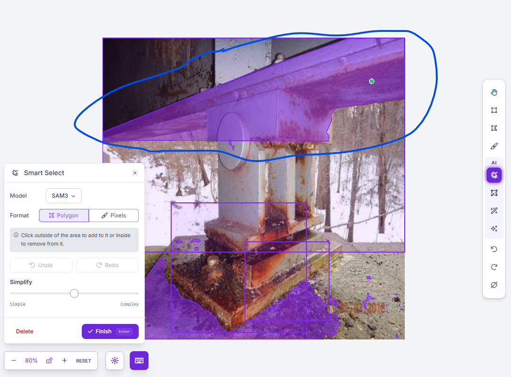
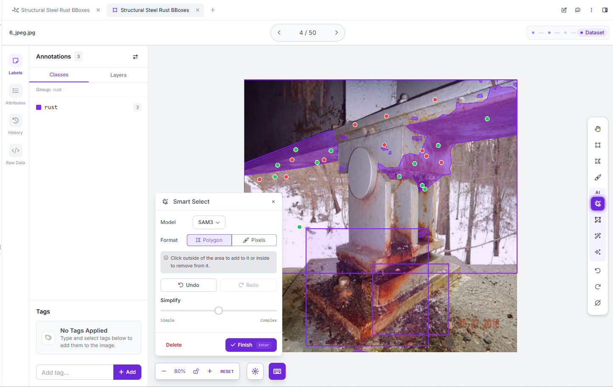
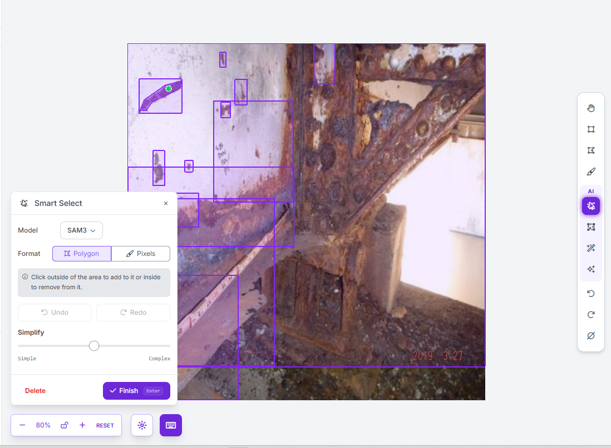

# SAM3 annotation exploration

Mohammad Mango | M4U3 Computer Vision | 24 September 2026

## Method
Two qualitative examples were explored in Roboflow Smart Select with the UI model selector set to **SAM3**, using Polygon output and point prompts. These are annotation-assistance trials, not YOLO training or a quantitative segmentation benchmark. The screenshots show previews before Finish. Existing rectangular rust annotations remain visible and must not be confused with the filled polygon preview.

## Example 1 — 6_jpeg.jpg: diffuse corrosion on a bridge bearing and beam
The initial preview selected much of the upper beam, including apparently intact painted areas, rather than isolating corrosion. Subsequent positive and negative point prompts excluded a large central painted region, but the preview retained irregular boundaries and small disconnected regions. Multiple corrections were required; the result was not accepted as a reliable rust-only annotation.

## Example 2 — 327_jpeg.jpg: isolated rust patch
A single visible positive point on the small diagonal brown patch at the upper left produced a polygon that visually followed the patch fairly closely, with limited surrounding paint included. This was a better starting annotation than the first example, although pixel accuracy was not measured against a reference mask.

## What helped and what failed
- A small isolated patch with clear visual contrast was easier to select in this trial.
- Positive and negative prompts helped remove unwanted painted regions in the complex example.
- Diffuse corrosion and mixed painted/rusted surfaces required repeated intervention and still produced imperfect boundaries.
- SAM3 proposals require human review under the rust labeling policy. A selected structural component is not automatically a correct rust mask.

## Effect on the submitted baseline
These previews were not incorporated into the frozen GitHub Release dataset or used to retrain the submitted YOLOv8 model. The baseline metrics therefore do not measure any improvement from SAM. No claim is made that all working annotations in the online editor remained unchanged; the reproduction source is the previously exported, checksum-pinned ZIP.

## Limits
Only two selected images were explored. No reference segmentation masks, IoU scores, controlled annotation-time measurements, or general performance estimates were produced. SAM3 is the model name displayed by the interface; the backend build/checkpoint was not independently recorded.
